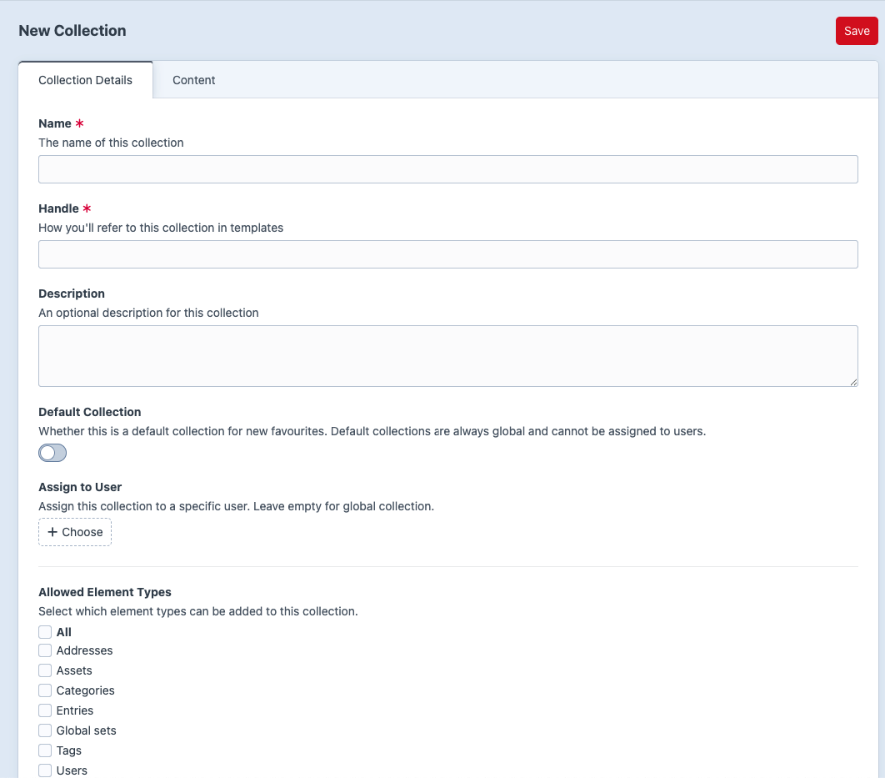
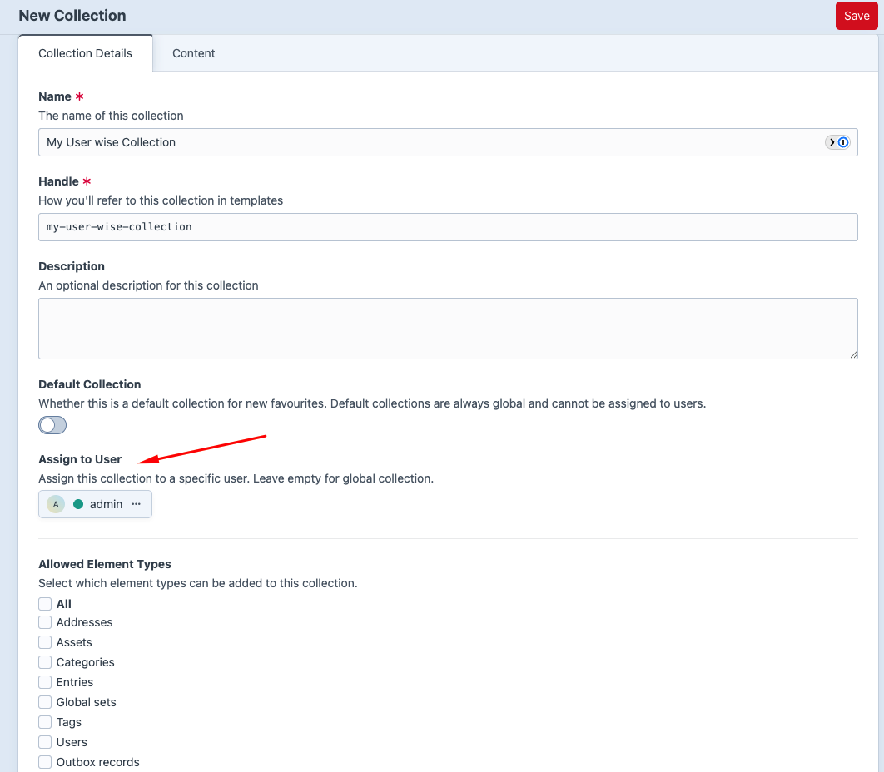
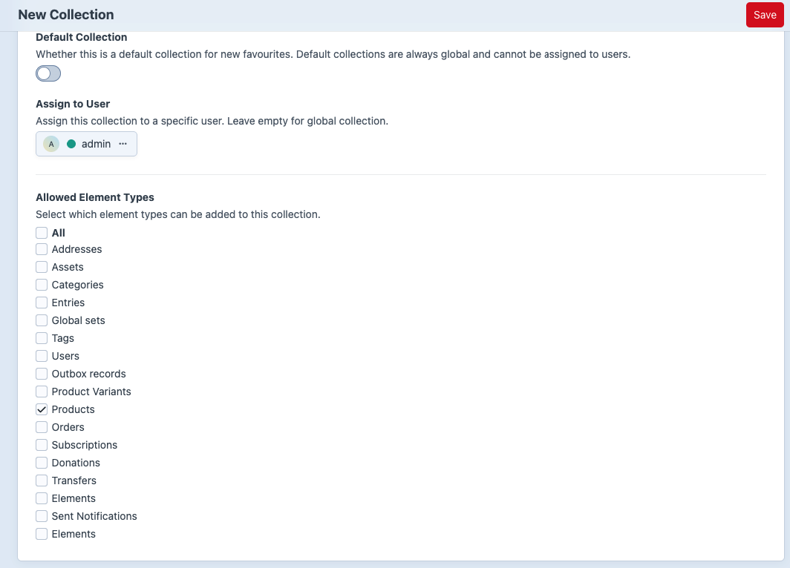

# Core Concepts

## Favourite Items

A favourite item records that a user saved a Craft element.

Main fields:

- `userId` - the user who saved the favourite.
- `collectionId` - the collection where the favourite lives.
- `elementId` - the saved Craft element ID.
- `elementType` - the saved Craft element class, such as `craft\elements\Entry`.
- `notes` - optional notes.
- `sortOrder` - optional manual ordering value.

Use favourite items when you need to list what was saved, who saved it, when it was saved, or which collection it belongs to.

## Collections

A collection is a container for favourite items.

Main fields:

- `name` - human readable label.
- `handle` - template-friendly identifier.
- `description` - optional explanation.
- `userId` - owner user ID, or `null` for global collections.
- `isDefault` - marks the default fallback collection.
- `allowedElementTypes` - array of allowed element classes. Empty array means all element types.
- `sortOrder` - optional manual ordering value.

## Global Collections

A global collection has no user assigned:

```twig

```

Use global collections for site-wide lists such as:

- Staff Picks
- Saved Articles
- Recommended Products
- Default Wishlist

In the Control Panel, leave **Assign to User** empty to create a global collection. This requires admin access or `super-favourite:manage-global-collections`.



## User Collections

A user collection has `userId` set to a Craft user.

```twig

```

Use user collections for personal lists such as:

- My Wishlist
- Read Later
- Buying Ideas
- Project Resources

In the Control Panel, choose a user in **Assign to User**.



## Default Collections

Default collections are used when a favourite is created without an explicit `collectionId`.

Important behavior:

- A default collection is global.
- When **Default Collection** is enabled in the CP, the user field is cleared/hidden.
- The plugin prevents deleting default collections.
- Only one global default collection should be active at a time.

## Allowed Element Types

Collections can restrict what kind of elements can be saved into them.

Examples:

- Product wishlist: allow Commerce products only.
- Reading list: allow entries only.
- Media board: allow assets only.
- General collection: allow all element types.

In the CP, use **Allowed Element Types** on the collection edit screen.



In frontend code, render options dynamically with `craft.superFavourite.getAvailableElementTypes()` so the form follows the element types registered in Craft:

```twig



    <label>
        <input type="checkbox" name="allowedElementTypes[]" value="{{ elementType.value }}">
        {{ elementType.label }}
    </label>

```

Always save through the plugin action/service. The favourite item element validates the collection's allowed element types before saving. In templates and PHP, `collection.allowedElementTypes` is already an array; do not call `json_decode`.

## Custom Fields on Collections

Collections are Craft elements with content support, so they can have custom fields.

Examples:

- `collectionTheme`
- `visibilityLabel`
- `coverImage`
- `shortIntro`
- `sortMode`

Add fields at **Super Favourite -> Settings -> Collection Fields**.

In Twig:

```twig



    <h1>{{ collection.name }}</h1>
    <p>{{ collection.shortIntro }}</p>

```

## Custom Fields on Favourite Items

Favourite items can also have custom fields.

Examples:

- `priority`
- `reason`
- `reminderDate`
- `giftRecipient`

Add fields at **Super Favourite -> Settings -> Favourite Fields**.

When saving frontend favourite forms, custom field values are read from the `fields` namespace:

```twig
<input type="text" name="fields[reason]" value="">
```

