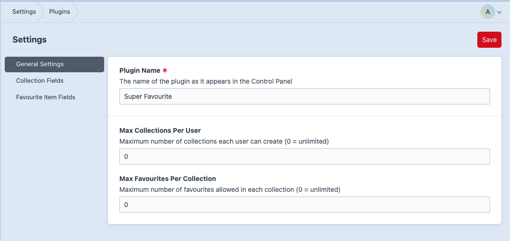
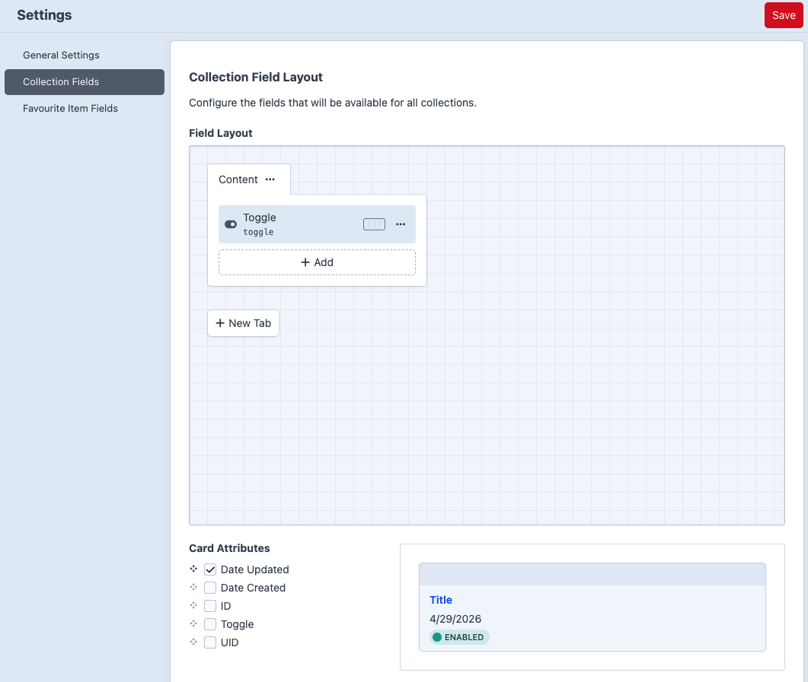
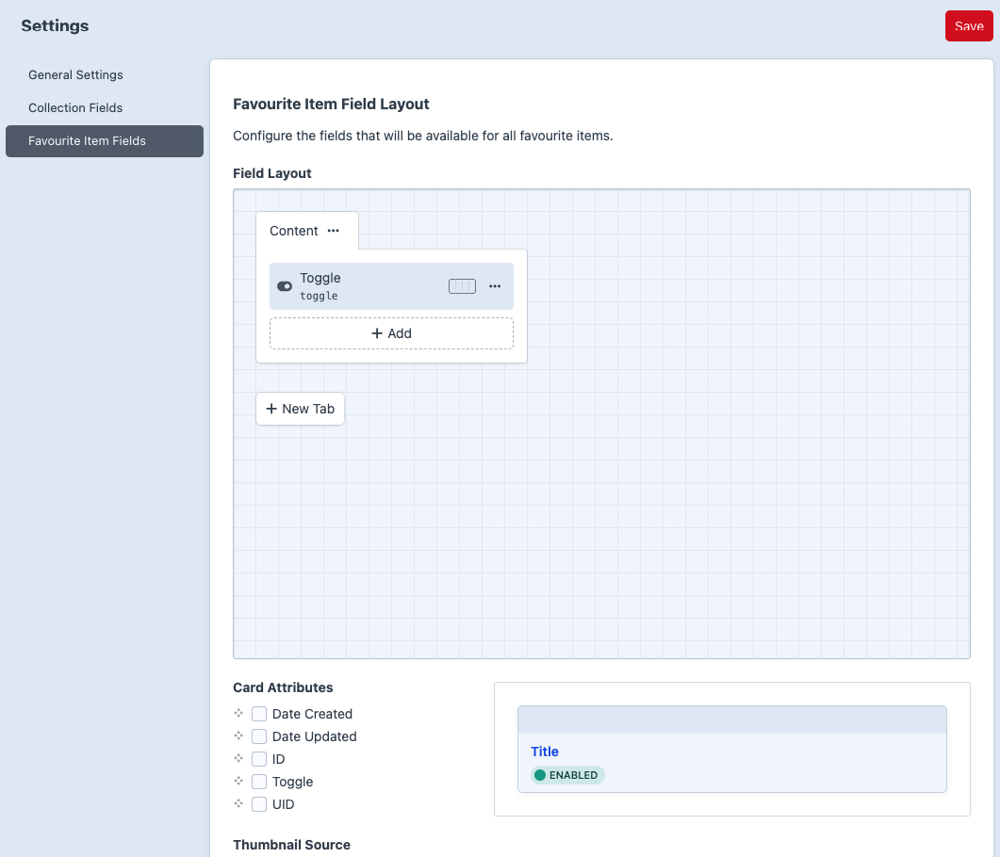

# Installation and Setup

## Requirements

- Craft CMS 5
- PHP 8.0.2 or newer
- A logged-in Craft user for frontend favourite actions

## Install From a Local Path Repository

Add the plugin your Craft project:

```bash
composer require amici/craft-super-favourite
```

Then install and enable it:

```bash
php craft plugin/install super-favourite
```

You can also install it from the Control Panel at **Settings -> Plugins**.

## First Setup Checklist

1. Go to **Super Favourite -> Settings -> General**.
2. Set the plugin name if you want a different CP nav label.
3. Set collection and favourite limits if needed. Use `0` for unlimited.
4. Go to **Super Favourite -> Settings -> Collection Fields** if collections need custom fields.
5. Go to **Super Favourite -> Settings -> Favourite Fields** if favourite items need custom fields.
6. Go to **Super Favourite -> Collections** and create at least one default/global collection.



## Settings

The general settings screen currently supports:

- `Plugin Name` - label used in the Control Panel navigation.
- `Max Collections Per User` - `0` means unlimited.
- `Max Favourites Per Collection` - `0` means unlimited.

Field layout screens support:

- Collection custom fields.
- Favourite item custom fields.




## Default Collection

The install migration creates a global collection named `Default` with handle `default`.

Favourite save/add forms must submit a valid `collectionId`. Use the default collection explicitly when that is where the favourite should be saved.

